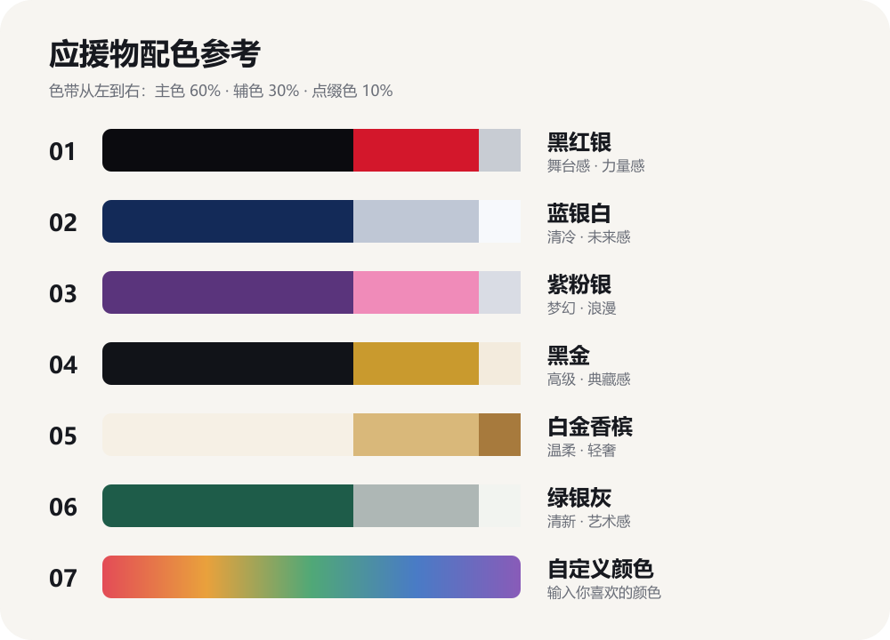

# 明星应援物生成器

一个面向 Codex 的个人 Skill：从人物姓名或用户上传的参考图出发，通过分步编号菜单生成明星应援手幅、小卡、海报、吧唧和纪念票等视觉设计。

## 功能

- 两种人物来源：上传参考图，或只输入姓名由 AI 生成
- 七类应援物模板
- 六套可视化预设配色和一项自定义配色
- 支持一次选择多个周边品类
- 已提供信息时自动跳过对应菜单
- 默认每个所选品类生成一张，避免无意义的批量生成
- 不联网搜索、下载或长期保存人物照片

## 操作流程

```text
人物名称／参考图
        ↓
人物来源（上传参考图／姓名生成）
        ↓
周边类型（1—7，可多选）
        ↓
配色（1—7）
        ↓
分别调用 ImageGen 生成
```

### 人物来源

1. 上传参考图：人物一致性更好
2. 只输入姓名，由 AI 生成：操作更快，但相貌稳定性较低

如果初始消息已经附带人物图片，Skill 会自动选择第 1 种并进入品类阶段；消息中已经明确品类时会跳过周边菜单。

### 周边类型

1. 应援手幅
2. 收藏小卡
3. 拍立得
4. 宣传海报／生日大屏
5. 四宫格明信片／歌词卡
6. 圆形吧唧
7. 演唱会纪念票

### 配色参考



预设配色按约 60% 主色、30% 辅色、10% 点缀色应用：

1. 黑红银
2. 蓝银白
3. 紫粉银
4. 黑金
5. 白金香槟
6. 绿银灰
7. 自定义颜色

## 安装

将整个仓库目录复制到个人 Codex Skills 目录：

```text
~/.codex/skills/creating-celebrity-support-merch/
```

Windows 示例：

```text
C:\Users\你的用户名\.codex\skills\creating-celebrity-support-merch\
```

安装完成后，重新开始一个 Codex 会话，Skill 即可被自动发现。

## 使用示例

自然语言触发：

```text
帮我做华晨宇的应援周边
```

也可以显式调用：

```text
$creating-celebrity-support-merch
```

多选示例：

```text
人物来源：2
周边：1、4、7
配色：3
```

如果已经准备好照片，可直接上传并说：

```text
用这张照片做应援周边
```

## 目录结构

```text
creating-celebrity-support-merch/
├── SKILL.md
├── README.md
├── LICENSE
├── agents/
│   └── openai.yaml
├── assets/
│   ├── palette-guide.png
│   └── palette-guide.svg
└── references/
    └── templates.md
```

## 注意事项

- 姓名生成模式不保证与真人完全一致；正式制作时建议上传有权使用的参考图。
- 生成结果不是官方明星周边，不应虚构代言、巡演、场馆、票价或官方授权。
- 图像中的复杂文字可能出现误差，适合先生成少字底图，再进行人工排版。
- 实际生图依赖 Codex 的 `imagegen` 能力。

## License

MIT License，详见 [LICENSE](LICENSE)。
